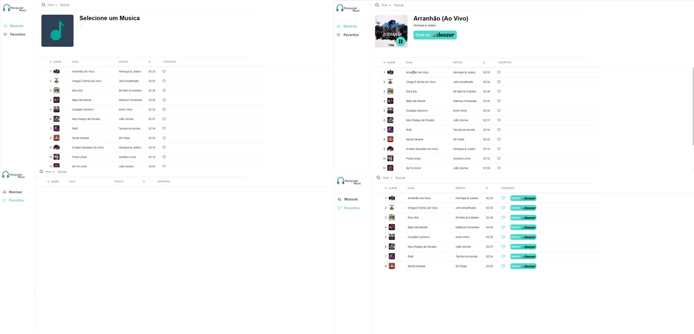

<br>

# Manipulaê Music

 <p align="center">Um web app de musicas feito em ReactJS, que utiliza a API do Deezer para obtenção e manipulação de dados.</p>

<br>

# 🎨 Telas



<br>
<br>


# 📃 Sobre o projeto

Um web app que lista e execulta, uma prévia das musicas brasileiras mais tocada no Deezer

Desenvolvido para o desafio da Manipulaê

Durante o desenvolvivemento foi econtrado um problema de CORS na API da Deezer, que bloqueia a conexão quando a requisição é feita em localhost. Diante desse problema, foi desenvolvido uma back-end (proxy) feito em nodeJS que fica responsável por comsumir a api do Deezer e retornar as dados para appliação ReactJS

<br>
<br>

# Funcionalidades

-   Consultar as músicas brasileiras mais ouvidas no Deezer

-   Realizar buscas por título musical, álbuns ou artistas

-   Executa a prévia da música por 30 segundos

- Ouvir música no site do Deezer

-   Adicionar ou remover músicas a lista de favoritos

<br><br>

# 🛠 Tecnologias utilizadas

## Back-End (Proxy)

-   NodeJS
-   Express - Criar o Servidor
-   📡Axios - Comunicação com a API do Deezer

<br>

## Frot-End

-   ⚛ React - Single page application
-   ⚛ React Router Dom - Controle de rotas
-   ⚛ Redux - Controle de estado das musicas e lista de favoritos
-   ⚛ React redux - Controle de estado das musicas e lista de favoritos
-   Styled-Components - Para a estilização dos componetes
-   📡Axios - Comunicação com a API Back-End

<br>

# 🚀 Rodando o projeto

A aplicação é dividida em duas partes, <b>manipulae_music_proxy_api</b> que faz a comunicação com a API Deezer e retorna os dados para o front-end, e <b>manipulae_music_webapp</b> que é o front-end

## Pré-requisitos

-   Git
-   NodeJS
-   Yarn
    <br>

## 💻 Rodando o Back-End (manipulae_music_proxy_api)

Clone o repositório

```bash
# Clone o repositório
git clone https://github.com/WBGreenArrow/manipulae.git
```
Navegue até a pasta do projeto clonado e execute os comandos abaixo

```bash
# Entra na pasta da manipulae_music_proxy_api
cd manipulae_music_proxy_api

# Instala as dependências
npm install
```

Após concluir a instalação das dependências, ainda no terminal da pasta do back-end execute o comando abaixo


```bash
# Inicia a aplicação back-end
yarn start
```
<br>

## 🖥 Rodando o front-end

Caso já tenha clonado o repositório basta pular a primeira etapa

```bash
# Clone o repositório
git clone https://github.com/WBGreenArrow/manipulae.git
```
Navegue até a pasta do projeto clonado e execute os comandos abaixo


```bash
# Entra na pasta do front-end
cd manipulae_music_webapp

# Instala as dependências
npm install
```


Após concluir a instalação das dependências, ainda no terminal da pasta do front-end execute o comando abaixo


```bash
# Inicia a aplicação
yarn start

# Após isso a aplicação pode ser utilizada acessando o endereço http://localhost:3000
```
